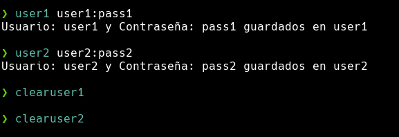

# PolyCredStore


## Uso



Con click izquierdo se copia el usuario

Con click derecho se copia la contraseña

## Funciones
Para crear las funciones se tiene que añadir lo siguiente en el `.bashrc` o en el `.zshrc` dependiendo de la shell que uses

### Función user1

La función "user1" toma un parámetro "credentials" que se asume contiene un nombre de usuario y una contraseña separados por dos puntos (:)

Es importante poner tu usuario donde pone "tuUsuario"

```bash
function user1(){
    credentials=$1
    user=`echo $credentials | cut -f1 -d:`
    pass=`echo $credentials | cut -f2 -d:`
    echo "Usuario: $user y Contraseña: $pass guardados en user1"
    echo "$credentials" > /home/tuUsuario/.config/bin/user1
}
```

### Función clearuser1

La función clearuser1 lo que hace es borrar las credenciales que están guardadas

Es importante poner tu usuario donde pone "tuUsuario"

```bash
function clearuser1(){
    echo "" > /home/tuUsuario/.config/bin/user1
}
```

### Función user2

La función "user2" toma un parámetro "credentials" que se asume contiene un nombre de usuario y una contraseña separados por dos puntos (:)

Es importante poner tu usuario donde pone "tuUsuario"

```bash
function user2(){
    credentials=$1
    user=`echo $credentials | cut -f1 -d:`
    pass=`echo $credentials | cut -f2 -d:`
    echo "Usuario: $user y Contraseña: $pass guardados en user2"
    echo "$credentials" > /home/tuUsuario/.config/bin/user2
}
```

### Función clearuser2

La función clearuser2 lo que hace es borrar las credenciales que están guardadas

Es importante poner tu usuario donde pone "tuUsuario"

```bash
function clearuser2(){
    echo "" > /home/tuUsuario/.config/bin/user2
}
```

## Archivos

```
chmod +x copyuser1_pass.sh copyuser2_pass.sh copyuser1_user.sh copyuser2_user.sh user1.sh user2.sh
mv copyuser1_pass.sh copyuser2_pass.sh copyuser1_user.sh copyuser2_user.sh user1.sh user2.sh ~/.config/bin/
```

## Modulos Polybar

### Modulo user1

```
[module/user1]
type = custom/script
interval = 1
exec = ~/.config/bin/user1.sh
click-left = ~/.config/bin/copyuser1_user.sh
click-right = ~/.config/bin/copyuser1_pass.sh
```

### Modulo user2

```
[module/user2]
type = custom/script
interval = 1
exec = ~/.config/bin/user2.sh
click-left = ~/.config/bin/copyuser2_user.sh
click-right = ~/.config/bin/copyuser2_pass.sh
```
